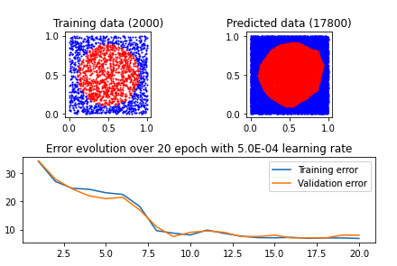

# Deepy

**Deepy** is a minimalistic deep learning framework built from scratch to demonstrate the core concepts of neural networks and backpropagation. It was developed as part of the EPFL course EE-559 Deep Learning in Spring 2020.

## Authors

- Jerome van der Elst
- Simon Janssen
- Christoph Tietz

## Features

- Custom implementation of neural network modules including:
  - Linear layers
  - Activation functions (ReLU, LeakyReLU, Tanh)
- Manual backpropagation using the chain rule.
- Data handling and splitting for training, validation, and testing.
- Gradient descent optimization.
- Example task: Circle classification.

## Requirements

- Python 3.x
- [PyTorch](https://pytorch.org/) for tensor operations.
- [Matplotlib](https://matplotlib.org/) (optional) for visualization.

## Usage

1. Clone the repository:
   ```bash
   git clone https://github.com/jeromevde/Deepy.git
   cd Deepy
   pip install torch matplotlib
   ````
2. run the notebook

## Example
```
inputs, targets = create_disc(20000)
model = Sequential(
    Linear(input_dim=2, output_dim=25, epsilon=1),
    ReLu(),
    Linear(input_dim=25, output_dim=25, epsilon=1),
    ReLu(),
    Linear(input_dim=25, output_dim=25, epsilon=1),
    Tanh(),
    Linear(input_dim=25, output_dim=2, epsilon=1),
    Tanh()
)
tr_error, v_error = train(model, tr_i, binaryToOneHot(tr_t), LEARNING_RATE, EPOCHS, v_i, binaryToOneHot(v_t))
draw_circle(t_i, t_t_pred, "Predicted data")
```

## Results
